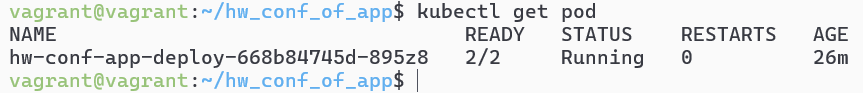
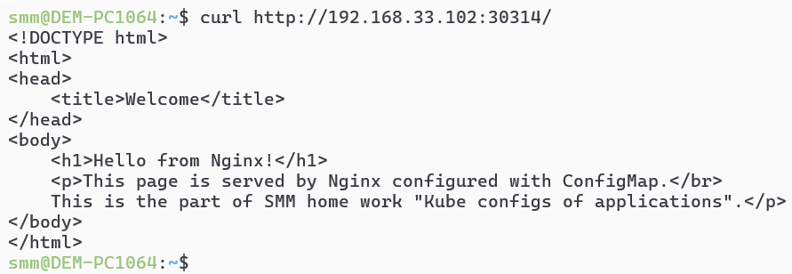
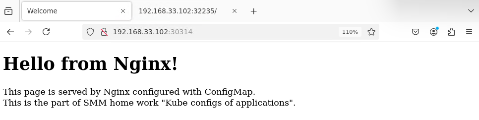
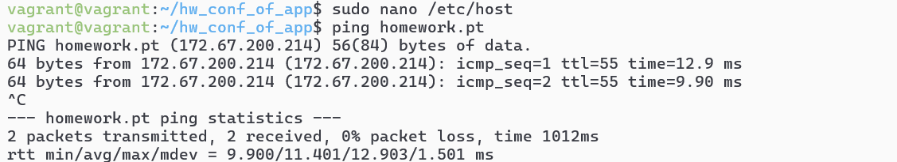
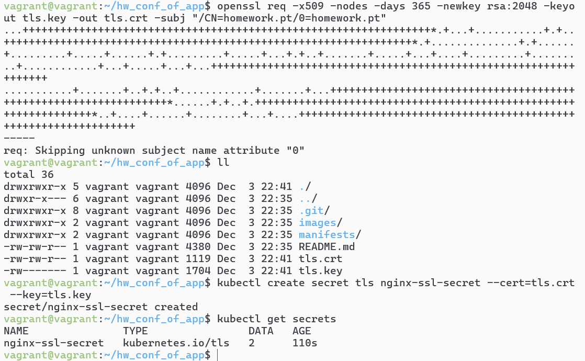
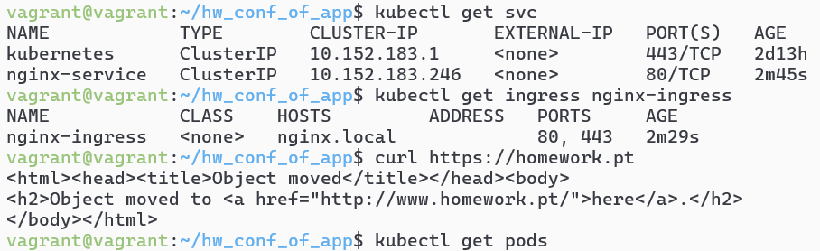

# Домашнее задание к занятию «Конфигурация приложений»- Михалёв Сергей

### Цель задания

В тестовой среде Kubernetes необходимо создать конфигурацию и продемонстрировать работу приложения.

------

### Задание 1. Создать Deployment приложения и решить возникшую проблему с помощью ConfigMap. Добавить веб-страницу

1. Создать Deployment приложения, состоящего из контейнеров nginx и multitool.
2. Решить возникшую проблему с помощью ConfigMap.
3. Продемонстрировать, что pod стартовал и оба конейнера работают.
4. Сделать простую веб-страницу и подключить её к Nginx с помощью ConfigMap. Подключить Service и показать вывод curl или в браузере.
5. Предоставить манифесты, а также скриншоты или вывод необходимых команд.

### Решение

1. Создал [deployment.yaml](manifests/deployment.yaml), , состоящий из контейнеров nginx и multitool.
2. Добавлены переменные окружения `PORT` для nginx и `HTTP_PORT` для multitool, которые читают значения из ConfigMap.
Поля containerPort в секции ports остались фиксированными, поскольку Kubernetes требует числовые значения. Контейнер сам будет слушать порт, указанный в переменных окружения.
2. Проверил pod стартовал и оба конейнера работают</br>

3. Написал простую веб-страницу и подключиk её к Nginx с помощью ConfigMap. 
3. Подключил [Service](manifests/service.yaml). В манифестах Service нельзя использовать переменные из ConfigMap напрямую. Однако сервис всё равно работает, потому что под слушает порты, указанные через переменные окружения в Deployment.</br>
Так как тип сервиса- NodePort, могу продемонстрировать вывод curl на хостовой машине.</br>

</br>
Вывод в браузере.</br>



------

### Задание 2. Создать приложение с вашей веб-страницей, доступной по HTTPS 

1. Создать Deployment приложения, состоящего из Nginx.
2. Создать собственную веб-страницу и подключить её как ConfigMap к приложению.
3. Выпустить самоподписной сертификат SSL. Создать Secret для использования сертификата.
4. Создать Ingress и необходимый Service, подключить к нему SSL в вид. Продемонстировать доступ к приложению по HTTPS. 
4. Предоставить манифесты, а также скриншоты или вывод необходимых команд.

### Решение

1. Создал [Deployment](manifests/nginx-deployment.yaml) приложения, состоящий из Nginx.
2. Взял веб-страницу из предыдущего задания и подключить её как ConfigMap к приложению.
3. Сделал запись в `/etc/host` для homework.pt. Проверил.</br>

4. Выпустил самоподписной сертификат SSL. Создал Secret для использования сертификата.</br>

5. Создал [Ingress](manifests/ingress.yaml) и необходимый [Service](manifests/nginx-service.yaml), подключил к нему SSL:
```
spec:
  tls:
    - hosts:
        - nginx.local
      secretName: nginx-ssl-secret
```
6. Проверил доступ к приложению по HTTPS.</br>
</br>
В виду настроек nginx получил перенаправление на страницу с http.
------
